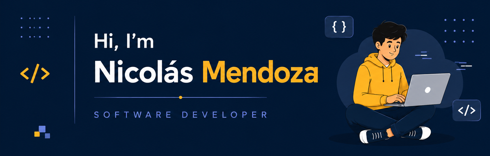

  

## 👋 About Me

I'm Nicolás Mendoza, a Software Developer from Paraguay 🇵🇾.

Passionate about software engineering, backend development, problem solving, and building software that creates real-world impact.

Currently developing my skills through the CodePRO program at Penguin Academy, where I have participated as:

- 🚀 Software Developer Trainee
- 👨‍💻 Team Lead in Hackathons
- 🎯 Coach for Bootcamp participants

I enjoy designing scalable systems, working with APIs, databases, software architecture, and creating efficient solutions through clean code.

---

## 🚀 Technologies & Tools

### Languages

### Backend

### Databases

### Tools

---

## 🏆 CodePRO Experience

- Team Lead in multiple Hackathons.
- Coach for Bootcamp Batch 5.1.
- Development of software engineering projects focused on:
  - Distributed Systems
  - APIs
  - Databases
  - Software Architecture
  - Algorithms
  - Backend Development

---

## 📂 Featured Projects

### 🔹 Microservices Architecture

Development of interconnected services using Python, Flask, REST APIs, and database integration.

🔗 Repository:
https://github.com/nicomendoza94/Microservicios

### 🔹 Authentication System

Authentication and authorization system using JavaScript and backend technologies.

🔗 Repository:
https://github.com/nicomendoza94/Autenticacion

### 🔹 CRUD MVC Application

Full CRUD application implementing MVC architecture and database persistence.

🔗 Repository:
https://github.com/nicomendoza94/CRUD

### 🔹 Minimax Algorithm

Artificial intelligence implementation using the Minimax algorithm for game decision-making.

🔗 Repository:
https://github.com/nicomendoza94/Algoritmo-Minimax

---

## 🌱 Currently Learning

- Software Engineering
- Backend Architecture
- Design Patterns
- API Design
- Database Optimization
- Clean Code Principles

---

## 📊 GitHub Statistics

---

## 🌐 Connect With Me

💼 LinkedIn:
https://linkedin.com/in/nicolasmendoza-dev

📍 Paraguay

